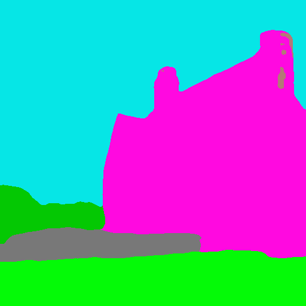
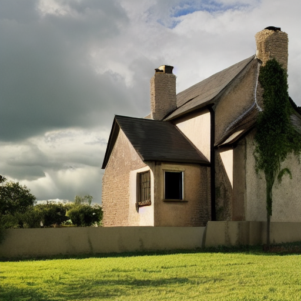
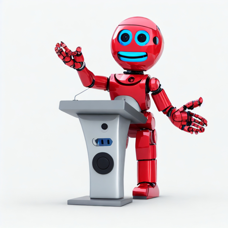
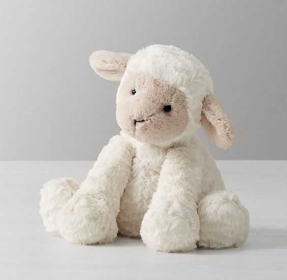
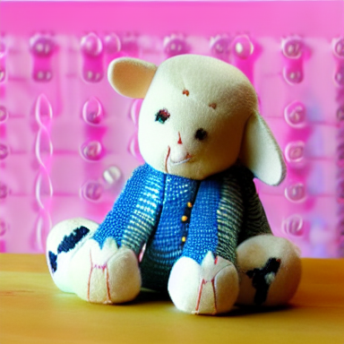

# Controlnet

Controlnet is an auxiliary model which augments pre-trained diffusion models with an additional conditioning.

Controlnet comes with multiple auxiliary models, each which allows a different type of conditioning

Controlnet's auxiliary models are trained with stable diffusion 1.5. Experimentally, the auxiliary models can be used with other diffusion models such as dreamboothed stable diffusion.

The auxiliary conditioning is passed directly to the diffusers pipeline. If you want to process an image to create the auxiliary conditioning, external dependencies are required.

Some of the additional conditionings can be extracted from images via additional models. We extracted these
additional models from the original controlnet repo into a separate package that can be found on [github](https://github.com/patrickvonplaten/controlnet_aux.git).

## Canny edge detection

### Diffusers

Install opencv

```sh
$ pip install opencv-contrib-python
```

```python
import cv2
from PIL import Image
from diffusers import StableDiffusionControlNetPipeline, ControlNetModel, UniPCMultistepScheduler
import torch
import numpy as np

image = Image.open('images/bird.png')
image = np.array(image)

low_threshold = 100
high_threshold = 200

image = cv2.Canny(image, low_threshold, high_threshold)
image = image[:, :, None]
image = np.concatenate([image, image, image], axis=2)
image = Image.fromarray(image)

controlnet = ControlNetModel.from_pretrained(
    "fusing/stable-diffusion-v1-5-controlnet-canny", torch_dtype=torch.float16
)

pipe = StableDiffusionControlNetPipeline.from_pretrained(
    "runwayml/stable-diffusion-v1-5", controlnet=controlnet, safety_checker=None, torch_dtype=torch.float16
)

pipe.scheduler = UniPCMultistepScheduler.from_config(pipe.scheduler.config)

# Remove if you do not have xformers installed
# see https://huggingface.co/docs/diffusers/v0.13.0/en/optimization/xformers#installing-xformers
# for installation instructions
pipe.enable_xformers_memory_efficient_attention()

pipe.enable_model_cpu_offload()

image = pipe("bird", image, num_inference_steps=20).images[0]

image.save('images/bird_canny_out.png')
```


### Training

The canny edge model was trained on 3M edge-image, caption pairs. The model was trained for 600 GPU-hours with Nvidia A100 80G using Stable Diffusion 1.5 as a base model. 

## M-LSD Straight line detection

### Diffusers

Install the additional controlnet models package.

```sh
$ pip install git+https://github.com/patrickvonplaten/controlnet_aux.git
```

```py
from PIL import Image
from diffusers import StableDiffusionControlNetPipeline, ControlNetModel, UniPCMultistepScheduler
import torch
from controlnet_aux import MLSDdetector

mlsd = MLSDdetector.from_pretrained('lllyasviel/ControlNet')

image = Image.open('images/room.png')

image = mlsd(image)

controlnet = ControlNetModel.from_pretrained(
    "fusing/stable-diffusion-v1-5-controlnet-mlsd", torch_dtype=torch.float16
)

pipe = StableDiffusionControlNetPipeline.from_pretrained(
    "runwayml/stable-diffusion-v1-5", controlnet=controlnet, safety_checker=None, torch_dtype=torch.float16
)

pipe.scheduler = UniPCMultistepScheduler.from_config(pipe.scheduler.config)

# Remove if you do not have xformers installed
# see https://huggingface.co/docs/diffusers/v0.13.0/en/optimization/xformers#installing-xformers
# for installation instructions
pipe.enable_xformers_memory_efficient_attention()

pipe.enable_model_cpu_offload()

image = pipe("room", image, num_inference_steps=20).images[0]

image.save('images/room_mlsd_out.png')
```


### Training

The hough line model was trained on 600k edge-image, caption pairs. The dataset was generated from Places2 using BLIP to generate text captions and a deep Hough transform to generate edge-images. The model was trained for 160 GPU-hours with Nvidia A100 80G using the Canny model as a base model.

## Pose estimation

### Diffusers

Install the additional controlnet models package.

```sh
$ pip install git+https://github.com/patrickvonplaten/controlnet_aux.git
```

```py
from PIL import Image
from diffusers import StableDiffusionControlNetPipeline, ControlNetModel, UniPCMultistepScheduler
import torch
from controlnet_aux import OpenposeDetector

openpose = OpenposeDetector.from_pretrained('lllyasviel/ControlNet')

image = Image.open('images/pose.png')

image = openpose(image)

controlnet = ControlNetModel.from_pretrained(
    "fusing/stable-diffusion-v1-5-controlnet-openpose", torch_dtype=torch.float16
)

pipe = StableDiffusionControlNetPipeline.from_pretrained(
    "runwayml/stable-diffusion-v1-5", controlnet=controlnet, safety_checker=None, torch_dtype=torch.float16
)

pipe.scheduler = UniPCMultistepScheduler.from_config(pipe.scheduler.config)

# Remove if you do not have xformers installed
# see https://huggingface.co/docs/diffusers/v0.13.0/en/optimization/xformers#installing-xformers
# for installation instructions
pipe.enable_xformers_memory_efficient_attention()

pipe.enable_model_cpu_offload()

image = pipe("chef in the kitchen", image, num_inference_steps=20).images[0]

image.save('images/chef_pose_out.png')
```


### Training

The Openpose model was trained on 200k pose-image, caption pairs. The pose estimation images were generated with Openpose. The model was trained for 300 GPU-hours with Nvidia A100 80G using Stable Diffusion 1.5 as a base model.

## Semantic Segmentation

### Diffusers

Semantic segmentation relies on transformers. Transformers is a 
dependency of diffusers for running controlnet, so you should 
have it installed already.

```py
from transformers import AutoImageProcessor, UperNetForSemanticSegmentation
from PIL import Image
import numpy as np
from controlnet_utils import ade_palette
import torch
from diffusers import StableDiffusionControlNetPipeline, ControlNetModel, UniPCMultistepScheduler

image_processor = AutoImageProcessor.from_pretrained("openmmlab/upernet-convnext-small")
image_segmentor = UperNetForSemanticSegmentation.from_pretrained("openmmlab/upernet-convnext-small")

image = Image.open("./images/house.png").convert('RGB')

pixel_values = image_processor(image, return_tensors="pt").pixel_values

with torch.no_grad():
  outputs = image_segmentor(pixel_values)

seg = image_processor.post_process_semantic_segmentation(outputs, target_sizes=[image.size[::-1]])[0]

color_seg = np.zeros((seg.shape[0], seg.shape[1], 3), dtype=np.uint8) # height, width, 3

palette = np.array(ade_palette())

for label, color in enumerate(palette):
    color_seg[seg == label, :] = color

color_seg = color_seg.astype(np.uint8)

image = Image.fromarray(color_seg)

controlnet = ControlNetModel.from_pretrained(
    "fusing/stable-diffusion-v1-5-controlnet-seg", torch_dtype=torch.float16
)

pipe = StableDiffusionControlNetPipeline.from_pretrained(
    "runwayml/stable-diffusion-v1-5", controlnet=controlnet, safety_checker=None, torch_dtype=torch.float16
)

pipe.scheduler = UniPCMultistepScheduler.from_config(pipe.scheduler.config)

# Remove if you do not have xformers installed
# see https://huggingface.co/docs/diffusers/v0.13.0/en/optimization/xformers#installing-xformers
# for installation instructions
pipe.enable_xformers_memory_efficient_attention()

pipe.enable_model_cpu_offload()

image = pipe("house", image, num_inference_steps=20).images[0]

image.save('./images/house_seg_out.png')
```






### Training

The semantic segmentation model was trained on 164K segmentation-image, caption pairs from ADE20K. The model was trained for 200 GPU-hours with Nvidia A100 80G using Stable Diffusion 1.5 as a base model.

## Depth control

### Diffusers

Depth control relies on transformers. Transformers is a dependency of diffusers for running controlnet, so
you should have it installed already.

```py
from transformers import pipeline
from diffusers import StableDiffusionControlNetPipeline, ControlNetModel, UniPCMultistepScheduler
from PIL import Image
import numpy as np
import torch

depth_estimator = pipeline('depth-estimation')

image = Image.open('./images/stormtrooper.png')
image = depth_estimator(image)['depth']
image = np.array(image)
image = image[:, :, None]
image = np.concatenate([image, image, image], axis=2)
image = Image.fromarray(image)

controlnet = ControlNetModel.from_pretrained(
    "fusing/stable-diffusion-v1-5-controlnet-depth", torch_dtype=torch.float16
)

pipe = StableDiffusionControlNetPipeline.from_pretrained(
    "runwayml/stable-diffusion-v1-5", controlnet=controlnet, safety_checker=None, torch_dtype=torch.float16
)

pipe.scheduler = UniPCMultistepScheduler.from_config(pipe.scheduler.config)

# Remove if you do not have xformers installed
# see https://huggingface.co/docs/diffusers/v0.13.0/en/optimization/xformers#installing-xformers
# for installation instructions
pipe.enable_xformers_memory_efficient_attention()

pipe.enable_model_cpu_offload()

image = pipe("Stormtrooper's lecture", image, num_inference_steps=20).images[0]

image.save('./images/stormtrooper_depth_out.png')
```




### Training

The depth model was trained on 3M depth-image, caption pairs. The depth images were generated with Midas. The model was trained for 500 GPU-hours with Nvidia A100 80G using Stable Diffusion 1.5 as a base model.


## Normal map

### Diffusers

```py
from PIL import Image
from transformers import pipeline
import numpy as np
import cv2
from diffusers import StableDiffusionControlNetPipeline, ControlNetModel, UniPCMultistepScheduler
import torch

image = Image.open("images/toy.png").convert("RGB")

depth_estimator = pipeline("depth-estimation", model ="Intel/dpt-hybrid-midas" )

image = depth_estimator(image)['predicted_depth'][0]

image = image.numpy()

image_depth = image.copy()
image_depth -= np.min(image_depth)
image_depth /= np.max(image_depth)

bg_threhold = 0.4

x = cv2.Sobel(image, cv2.CV_32F, 1, 0, ksize=3)
x[image_depth < bg_threhold] = 0

y = cv2.Sobel(image, cv2.CV_32F, 0, 1, ksize=3)
y[image_depth < bg_threhold] = 0

z = np.ones_like(x) * np.pi * 2.0

image = np.stack([x, y, z], axis=2)
image /= np.sum(image ** 2.0, axis=2, keepdims=True) ** 0.5
image = (image * 127.5 + 127.5).clip(0, 255).astype(np.uint8)
image = Image.fromarray(image)

controlnet = ControlNetModel.from_pretrained(
    "fusing/stable-diffusion-v1-5-controlnet-normal", torch_dtype=torch.float16
)

pipe = StableDiffusionControlNetPipeline.from_pretrained(
    "runwayml/stable-diffusion-v1-5", controlnet=controlnet, safety_checker=None, torch_dtype=torch.float16
)

pipe.scheduler = UniPCMultistepScheduler.from_config(pipe.scheduler.config)

# Remove if you do not have xformers installed
# see https://huggingface.co/docs/diffusers/v0.13.0/en/optimization/xformers#installing-xformers
# for installation instructions
pipe.enable_xformers_memory_efficient_attention()

pipe.enable_model_cpu_offload()

image = pipe("cute toy", image, num_inference_steps=20).images[0]

image.save('images/toy_normal_out.png')
```






### Training

The normal model was trained from an initial model and then a further extended model.

The initial normal model was trained on 25,452 normal-image, caption pairs from DIODE. The image captions were generated by BLIP. The model was trained for 100 GPU-hours with Nvidia A100 80G using Stable Diffusion 1.5 as a base model.

The extended normal model further trained the initial normal model on "coarse" normal maps. The coarse normal maps were generated using Midas to compute a depth map and then performing normal-from-distance. The model was trained for 200 GPU-hours with Nvidia A100 80G using the initial normal model as a base model.

## Scribble

Install the additional controlnet models package.

```sh
$ pip install git+https://github.com/patrickvonplaten/controlnet_aux.git
```

```py
from PIL import Image
from diffusers import StableDiffusionControlNetPipeline, ControlNetModel, UniPCMultistepScheduler
import torch
from controlnet_aux import HEDdetector

hed = HEDdetector.from_pretrained('lllyasviel/ControlNet')

image = Image.open('images/bag.png')

image = hed(image, scribble=True)

controlnet = ControlNetModel.from_pretrained(
    "fusing/stable-diffusion-v1-5-controlnet-scribble", torch_dtype=torch.float16
)

pipe = StableDiffusionControlNetPipeline.from_pretrained(
    "runwayml/stable-diffusion-v1-5", controlnet=controlnet, safety_checker=None, torch_dtype=torch.float16
)

pipe.scheduler = UniPCMultistepScheduler.from_config(pipe.scheduler.config)

# Remove if you do not have xformers installed
# see https://huggingface.co/docs/diffusers/v0.13.0/en/optimization/xformers#installing-xformers
# for installation instructions
pipe.enable_xformers_memory_efficient_attention()

pipe.enable_model_cpu_offload()

image = pipe("bag", image, num_inference_steps=20).images[0]

image.save('images/bag_scribble_out.png')
```


### Training

The scribble model was trained on 500k scribble-image, caption pairs. The scribble images were generated with HED boundary detection and a set of data augmentations — thresholds, masking, morphological transformations, and non-maximum suppression. The model was trained for 150 GPU-hours with Nvidia A100 80G using the canny model as a base model.

## HED Boundary

### Diffusers

Install the additional controlnet models package.

```sh
$ pip install git+https://github.com/patrickvonplaten/controlnet_aux.git
```

```py
from PIL import Image
from diffusers import StableDiffusionControlNetPipeline, ControlNetModel, UniPCMultistepScheduler
import torch
from controlnet_aux import HEDdetector

hed = HEDdetector.from_pretrained('lllyasviel/ControlNet')

image = Image.open('images/man.png')

image = hed(image)

controlnet = ControlNetModel.from_pretrained(
    "fusing/stable-diffusion-v1-5-controlnet-hed", torch_dtype=torch.float16
)

pipe = StableDiffusionControlNetPipeline.from_pretrained(
    "runwayml/stable-diffusion-v1-5", controlnet=controlnet, safety_checker=None, torch_dtype=torch.float16
)

pipe.scheduler = UniPCMultistepScheduler.from_config(pipe.scheduler.config)

# Remove if you do not have xformers installed
# see https://huggingface.co/docs/diffusers/v0.13.0/en/optimization/xformers#installing-xformers
# for installation instructions
pipe.enable_xformers_memory_efficient_attention()

pipe.enable_model_cpu_offload()

image = pipe("oil painting of handsome old man, masterpiece", image, num_inference_steps=20).images[0]

image.save('images/man_hed_out.png')
```


### Training

The HED Edge model was trained on 3M edge-image, caption pairs. The model was trained for 600 GPU-hours with Nvidia A100 80G using Stable Diffusion 1.5 as a base model. 
