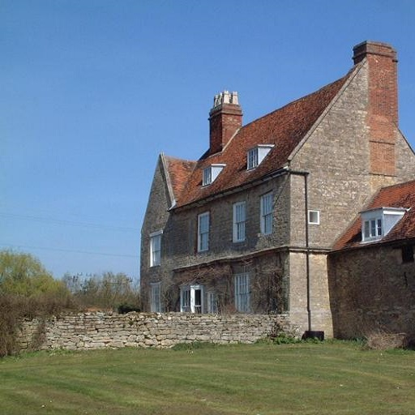
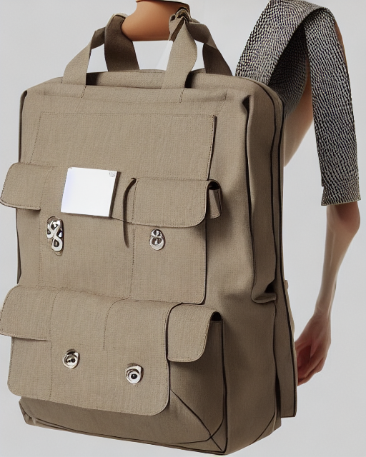

# Controlnet

Controlnet is an auxiliary model which augments pre-trained diffusion model with additional conditioning.

Controlnet comes with multiple auxiliary models, each which allows a different type of conditioning

The auxiliary conditioning is passed directly to the diffusers pipeline. If you want to process on image to create the auxiliary conditioning, external dependencies are required.

Controlnet's auxiliary models are trained with stable diffusion 1.5. Experimentally, the auxiliary models can be used with other diffusion models such as dreamboothed stable diffusion.

Some of the additional conditionings can be extracted from images via additional models. We extracted these
additional models from the original controlnet repo into a separate package that can be found on [github](https://github.com/patrickvonplaten/human_pose.git).

## Canny edge detection

Install opencv

```sh
$ pip install opencv-contrib-python
```

```python
import cv2
from PIL import Image
from diffusers import StableDiffusionControlNetPipeline, ControlNetModel
import torch
import numpy as np

image = Image.open('images/bird.png')
image = np.array(image)

low_threshold = 100
high_threshold = 200

image = cv2.Canny(image, low_threshold, high_threshold)
image = image[:, :, None]
image = np.concatenate([image, image, image], axis=2)
image = Image.fromarray(image)

controlnet = ControlNetModel.from_pretrained(
    "fusing/stable-diffusion-v1-5-controlnet-canny",
)

pipe = StableDiffusionControlNetPipeline.from_pretrained(
    "runwayml/stable-diffusion-v1-5", controlnet=controlnet, safety_checker=None
)
pipe.to('cuda')

image = pipe("bird", image).images[0]

image.save('images/bird_canny_out.png')
```


## M-LSD Straight line detection

Install the additional controlnet models package.

```sh
$ pip install git+https://github.com/patrickvonplaten/human_pose.git
```

```py
from PIL import Image
from diffusers import StableDiffusionControlNetPipeline, ControlNetModel
import torch
from human_pose import MLSDdetector

mlsd = MLSDdetector.from_pretrained('lllyasviel/ControlNet')

image = Image.open('images/room.png')

image = mlsd(image)

controlnet = ControlNetModel.from_pretrained(
    "fusing/stable-diffusion-v1-5-controlnet-mlsd",
)

pipe = StableDiffusionControlNetPipeline.from_pretrained(
    "runwayml/stable-diffusion-v1-5", controlnet=controlnet, safety_checker=None
)
pipe.to('cuda')

image = pipe("room", image).images[0]

image.save('images/room_mlsd_out.png')
```


## Pose estimation

Install the additional controlnet models package.

```sh
$ pip install git+https://github.com/patrickvonplaten/human_pose.git
```

```py
from PIL import Image
from diffusers import StableDiffusionControlNetPipeline, ControlNetModel
import torch
from human_pose import OpenposeDetector

openpose = OpenposeDetector.from_pretrained('lllyasviel/ControlNet')

image = Image.open('images/pose.png')

image = openpose(image)

controlnet = ControlNetModel.from_pretrained(
    "fusing/stable-diffusion-v1-5-controlnet-openpose",
)

pipe = StableDiffusionControlNetPipeline.from_pretrained(
    "runwayml/stable-diffusion-v1-5", controlnet=controlnet, safety_checker=None
)
pipe.to('cuda')

image = pipe("chef in the kitchen", image).images[0]

image.save('images/chef_pose_out.png')
```


## Semantic Segmentation

```py
from transformers import AutoImageProcessor, UperNetForSemanticSegmentation
from PIL import Image
import numpy as np
from controlnet_utils import ade_palette
import torch
from diffusers import StableDiffusionControlNetPipeline, ControlNetModel

image_processor = AutoImageProcessor.from_pretrained("openmmlab/upernet-convnext-small")
image_segmentor = UperNetForSemanticSegmentation.from_pretrained("openmmlab/upernet-convnext-small")

image = Image.open("./images/house.png").convert('RGB')

pixel_values = image_processor(image, return_tensors="pt").pixel_values

with torch.no_grad():
  outputs = image_segmentor(pixel_values)

seg = image_processor.post_process_semantic_segmentation(outputs, target_sizes=[image.size[::-1]])[0]

color_seg = np.zeros((seg.shape[0], seg.shape[1], 3), dtype=np.uint8) # height, width, 3

palette = np.array(ade_palette())

for label, color in enumerate(palette):
    color_seg[seg == label, :] = color

color_seg = color_seg.astype(np.uint8)

image = Image.fromarray(color_seg)

controlnet = ControlNetModel.from_pretrained(
    "fusing/stable-diffusion-v1-5-controlnet-seg",
)

pipe = StableDiffusionControlNetPipeline.from_pretrained(
    "runwayml/stable-diffusion-v1-5", controlnet=controlnet, safety_checker=None
)
pipe.to('cuda')

image = pipe("house", image).images[0]

image.save('./images/house_seg_out.png')
```




## Depth control

Depth control relies on transformers. Transformers is a dependency of diffusers for running controlnet, so
you should have it installed already.

```py
from transformers import pipeline
from diffusers import StableDiffusionControlNetPipeline, ControlNetModel
from PIL import Image
import numpy as np

depth_estimator = pipeline('depth-estimation')

image = Image.open('./images/stormtrooper.png')
image = depth_estimator(image)['depth']
image = np.array(image)
image = image[:, :, None]
image = np.concatenate([image, image, image], axis=2)
image = Image.fromarray(image)

controlnet = ControlNetModel.from_pretrained(
    "fusing/stable-diffusion-v1-5-controlnet-depth",
)

pipe = StableDiffusionControlNetPipeline.from_pretrained(
    "runwayml/stable-diffusion-v1-5", controlnet=controlnet, safety_checker=None
)
pipe.to('cuda')

image = pipe("Stormtrooper's lecture", image).images[0]

image.save('./images/stormtrooper_depth_out.png')
```

## Normal map

TODO

## Scribble

Install the additional controlnet models package.

```sh
$ pip install git+https://github.com/patrickvonplaten/human_pose.git
```

```py
from PIL import Image
from diffusers import StableDiffusionControlNetPipeline, ControlNetModel
import torch
from human_pose import HEDdetector

hed = HEDdetector.from_pretrained('lllyasviel/ControlNet')

image = Image.open('images/bag.png')

image = hed(image, scribble=True)

controlnet = ControlNetModel.from_pretrained(
    "fusing/stable-diffusion-v1-5-controlnet-scribble",
)

pipe = StableDiffusionControlNetPipeline.from_pretrained(
    "runwayml/stable-diffusion-v1-5", controlnet=controlnet, safety_checker=None
)
pipe.to('cuda')

image = pipe("bag", image).images[0]

image.save('images/bag_scribble_out.png')
```




## HED Boundary

Install the additional controlnet models package.

```sh
$ pip install git+https://github.com/patrickvonplaten/human_pose.git
```

```py
from PIL import Image
from diffusers import StableDiffusionControlNetPipeline, ControlNetModel
import torch
from human_pose import HEDdetector

hed = HEDdetector.from_pretrained('lllyasviel/ControlNet')

image = Image.open('images/man.png')

image = hed(image)

controlnet = ControlNetModel.from_pretrained(
    "fusing/stable-diffusion-v1-5-controlnet-hed",
)

pipe = StableDiffusionControlNetPipeline.from_pretrained(
    "runwayml/stable-diffusion-v1-5", controlnet=controlnet, safety_checker=None
)
pipe.to('cuda')

image = pipe("oil painting of handsome old man, masterpiece", image).images[0]

image.save('images/man_hed_out.png')
```


