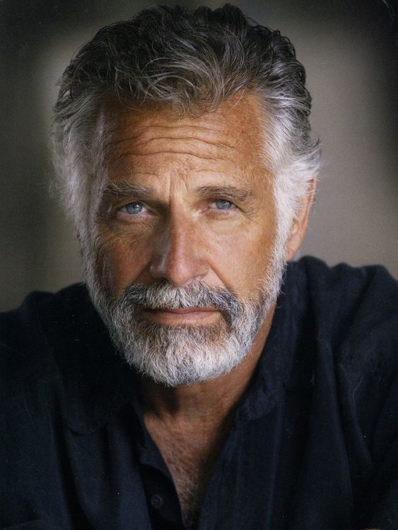

# Controlnet

Controlnet is an auxiliary model which augments pre-trained diffusion models with an additional conditioning.

Controlnet comes with multiple auxiliary models, each which allows a different type of conditioning

Controlnet's auxiliary models are trained with stable diffusion 1.5. Experimentally, the auxiliary models can be used with other diffusion models such as dreamboothed stable diffusion.

The auxiliary conditioning is passed directly to the diffusers pipeline. If you want to process an image to create the auxiliary conditioning, external dependencies are required.

Some of the additional conditionings can be extracted from images via additional models. We extracted these
additional models from the original controlnet repo into a separate package that can be found on [github](https://github.com/patrickvonplaten/controlnet_aux.git).

## HED Boundary

### Diffusers

Install the additional controlnet models package.

```sh
$ pip install git+https://github.com/patrickvonplaten/controlnet_aux.git
```

```py
from PIL import Image
from diffusers import StableDiffusionControlNetPipeline, ControlNetModel, UniPCMultistepScheduler
import torch
from controlnet_aux import HEDdetector

hed = HEDdetector.from_pretrained('lllyasviel/ControlNet')

image = Image.open('images/man.png')

image = hed(image)

controlnet = ControlNetModel.from_pretrained(
    "fusing/stable-diffusion-v1-5-controlnet-hed", torch_dtype=torch.float16
)

pipe = StableDiffusionControlNetPipeline.from_pretrained(
    "runwayml/stable-diffusion-v1-5", controlnet=controlnet, safety_checker=None, torch_dtype=torch.float16
)

pipe.scheduler = UniPCMultistepScheduler.from_config(pipe.scheduler.config)

# Remove if you do not have xformers installed
# see https://huggingface.co/docs/diffusers/v0.13.0/en/optimization/xformers#installing-xformers
# for installation instructions
pipe.enable_xformers_memory_efficient_attention()

pipe.enable_model_cpu_offload()

image = pipe("oil painting of handsome old man, masterpiece", image, num_inference_steps=20).images[0]

image.save('images/man_hed_out.png')
```




### Training

The HED Edge model was trained on 3M edge-image, caption pairs. The model was trained for 600 GPU-hours with Nvidia A100 80G using Stable Diffusion 1.5 as a base model. 
