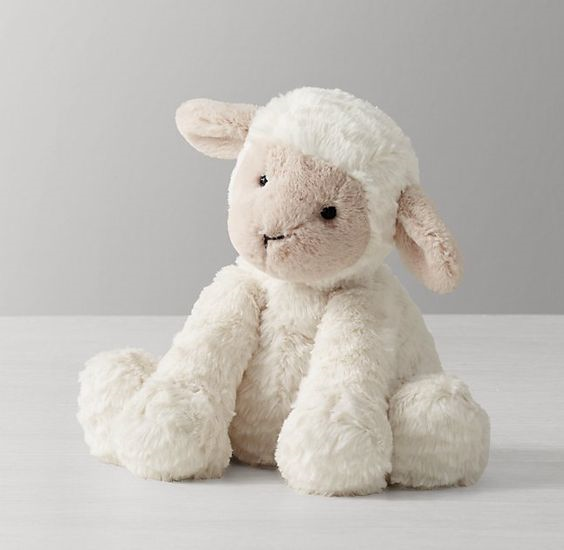
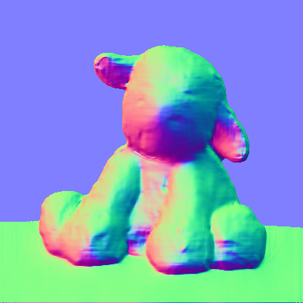
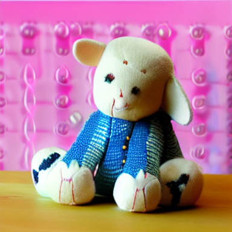

# Controlnet

Controlnet is an auxiliary model which augments pre-trained diffusion models with an additional conditioning.

Controlnet comes with multiple auxiliary models, each which allows a different type of conditioning

Controlnet's auxiliary models are trained with stable diffusion 1.5. Experimentally, the auxiliary models can be used with other diffusion models such as dreamboothed stable diffusion.

The auxiliary conditioning is passed directly to the diffusers pipeline. If you want to process an image to create the auxiliary conditioning, external dependencies are required.

Some of the additional conditionings can be extracted from images via additional models. We extracted these
additional models from the original controlnet repo into a separate package that can be found on [github](https://github.com/patrickvonplaten/controlnet_aux.git).

## Normal map

### Diffusers

```py
from PIL import Image
from transformers import pipeline
import numpy as np
import cv2
from diffusers import StableDiffusionControlNetPipeline, ControlNetModel, UniPCMultistepScheduler
import torch

image = Image.open("images/toy.png").convert("RGB")

depth_estimator = pipeline("depth-estimation", model ="Intel/dpt-hybrid-midas" )

image = depth_estimator(image)['predicted_depth'][0]

image = image.numpy()

image_depth = image.copy()
image_depth -= np.min(image_depth)
image_depth /= np.max(image_depth)

bg_threhold = 0.4

x = cv2.Sobel(image, cv2.CV_32F, 1, 0, ksize=3)
x[image_depth < bg_threhold] = 0

y = cv2.Sobel(image, cv2.CV_32F, 0, 1, ksize=3)
y[image_depth < bg_threhold] = 0

z = np.ones_like(x) * np.pi * 2.0

image = np.stack([x, y, z], axis=2)
image /= np.sum(image ** 2.0, axis=2, keepdims=True) ** 0.5
image = (image * 127.5 + 127.5).clip(0, 255).astype(np.uint8)
image = Image.fromarray(image)

controlnet = ControlNetModel.from_pretrained(
    "fusing/stable-diffusion-v1-5-controlnet-normal", torch_dtype=torch.float16
)

pipe = StableDiffusionControlNetPipeline.from_pretrained(
    "runwayml/stable-diffusion-v1-5", controlnet=controlnet, safety_checker=None, torch_dtype=torch.float16
)

pipe.scheduler = UniPCMultistepScheduler.from_config(pipe.scheduler.config)

# Remove if you do not have xformers installed
# see https://huggingface.co/docs/diffusers/v0.13.0/en/optimization/xformers#installing-xformers
# for installation instructions
pipe.enable_xformers_memory_efficient_attention()

pipe.enable_model_cpu_offload()

image = pipe("cute toy", image, num_inference_steps=20).images[0]

image.save('images/toy_normal_out.png')
```







### Training

The normal model was trained from an initial model and then a further extended model.

The initial normal model was trained on 25,452 normal-image, caption pairs from DIODE. The image captions were generated by BLIP. The model was trained for 100 GPU-hours with Nvidia A100 80G using Stable Diffusion 1.5 as a base model.

The extended normal model further trained the initial normal model on "coarse" normal maps. The coarse normal maps were generated using Midas to compute a depth map and then performing normal-from-distance. The model was trained for 200 GPU-hours with Nvidia A100 80G using the initial normal model as a base model.
