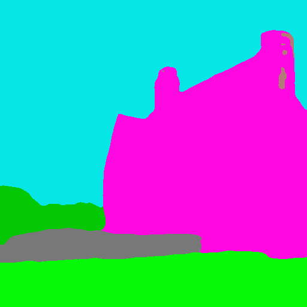
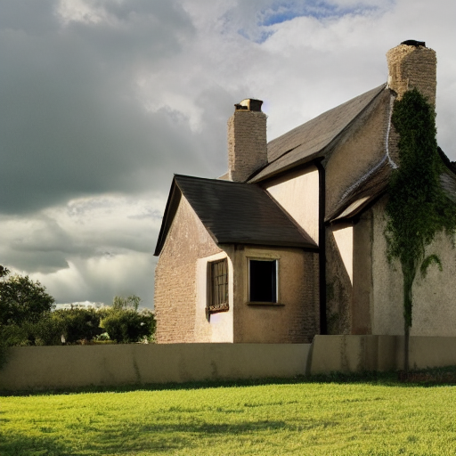

# Controlnet

Controlnet is an auxiliary model which augments pre-trained diffusion models with an additional conditioning.

Controlnet comes with multiple auxiliary models, each which allows a different type of conditioning

Controlnet's auxiliary models are trained with stable diffusion 1.5. Experimentally, the auxiliary models can be used with other diffusion models such as dreamboothed stable diffusion.

The auxiliary conditioning is passed directly to the diffusers pipeline. If you want to process an image to create the auxiliary conditioning, external dependencies are required.

Some of the additional conditionings can be extracted from images via additional models. We extracted these
additional models from the original controlnet repo into a separate package that can be found on [github](https://github.com/patrickvonplaten/controlnet_aux.git).

## Semantic Segmentation

### Diffusers

Semantic segmentation relies on transformers. Transformers is a 
dependency of diffusers for running controlnet, so you should 
have it installed already.

```py
from transformers import AutoImageProcessor, UperNetForSemanticSegmentation
from PIL import Image
import numpy as np
from controlnet_utils import ade_palette
import torch
from diffusers import StableDiffusionControlNetPipeline, ControlNetModel, UniPCMultistepScheduler

image_processor = AutoImageProcessor.from_pretrained("openmmlab/upernet-convnext-small")
image_segmentor = UperNetForSemanticSegmentation.from_pretrained("openmmlab/upernet-convnext-small")

image = Image.open("./images/house.png").convert('RGB')

pixel_values = image_processor(image, return_tensors="pt").pixel_values

with torch.no_grad():
  outputs = image_segmentor(pixel_values)

seg = image_processor.post_process_semantic_segmentation(outputs, target_sizes=[image.size[::-1]])[0]

color_seg = np.zeros((seg.shape[0], seg.shape[1], 3), dtype=np.uint8) # height, width, 3

palette = np.array(ade_palette())

for label, color in enumerate(palette):
    color_seg[seg == label, :] = color

color_seg = color_seg.astype(np.uint8)

image = Image.fromarray(color_seg)

controlnet = ControlNetModel.from_pretrained(
    "fusing/stable-diffusion-v1-5-controlnet-seg", torch_dtype=torch.float16
)

pipe = StableDiffusionControlNetPipeline.from_pretrained(
    "runwayml/stable-diffusion-v1-5", controlnet=controlnet, safety_checker=None, torch_dtype=torch.float16
)

pipe.scheduler = UniPCMultistepScheduler.from_config(pipe.scheduler.config)

# Remove if you do not have xformers installed
# see https://huggingface.co/docs/diffusers/v0.13.0/en/optimization/xformers#installing-xformers
# for installation instructions
pipe.enable_xformers_memory_efficient_attention()

pipe.enable_model_cpu_offload()

image = pipe("house", image, num_inference_steps=20).images[0]

image.save('./images/house_seg_out.png')
```






### Training

The semantic segmentation model was trained on 164K segmentation-image, caption pairs from ADE20K. The model was trained for 200 GPU-hours with Nvidia A100 80G using Stable Diffusion 1.5 as a base model.
